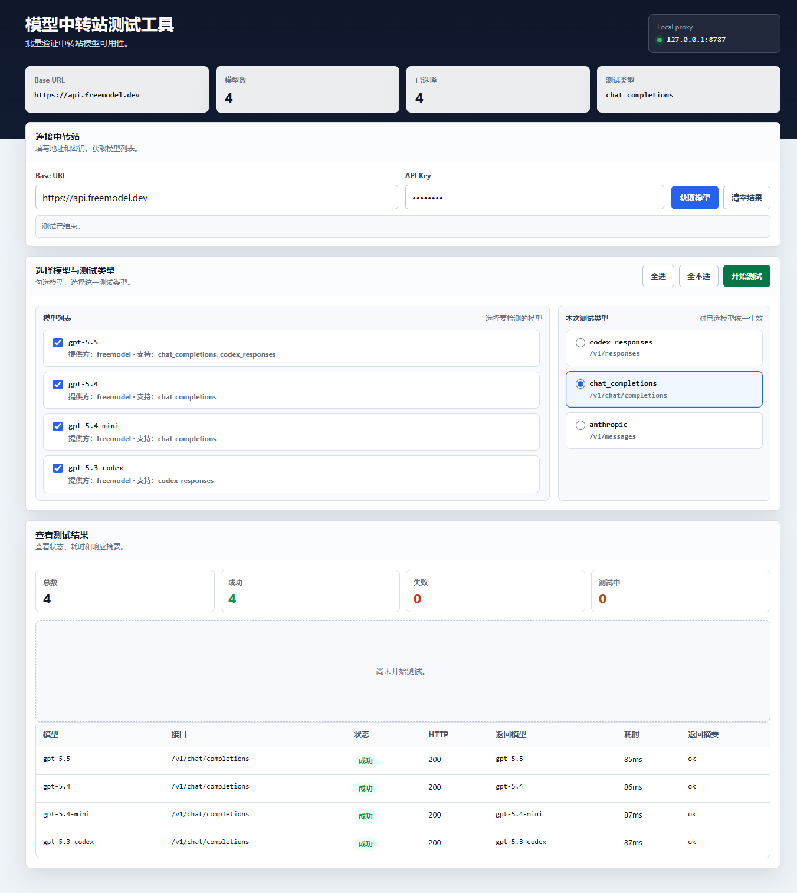

# RelayProbe

RelayProbe 是一个轻量的模型中转站探测工具，用来批量检查中转站模型列表和常见推理接口是否可用。



## 功能特性

- 通过本地代理请求中转站，避免浏览器跨域限制。
- 获取 `/v1/models` 模型列表并批量选择要测试的模型。
- 支持三类测试端点：
  - `codex_responses` -> `/v1/responses`
  - `chat_completions` -> `/v1/chat/completions`
  - `anthropic` -> `/v1/messages`
- 展示每个模型的 HTTP 状态、耗时、返回模型名和响应摘要。
- 无前端构建步骤，使用原生 HTML/CSS/JavaScript 和 Node.js 内置模块。

## 运行要求

- Node.js 18 或更高版本
- 一个兼容 OpenAI 或 Anthropic 风格接口的模型中转站
- 中转站 API Key

## 快速开始

克隆项目后进入目录：

```bash
git clone <your-repository-url>
cd relay-probe
```

启动本地服务：

```bash
npm start
```

或者直接运行：

```bash
node server.js
```

默认访问地址：

```text
http://127.0.0.1:8787
```

Windows 用户也可以双击 `start.bat` 启动。

## 使用方式

1. 在 `Base URL` 中填写中转站地址，例如 `https://api.example.com`。
2. 在 `API Key` 中填写密钥。
3. 点击 `获取模型`，工具会通过本地服务请求 `${Base URL}/v1/models`。
4. 勾选要测试的模型。
5. 选择测试类型：
   - `codex_responses`：适用于 Responses API 兼容接口。
   - `chat_completions`：适用于 Chat Completions API 兼容接口。
   - `anthropic`：适用于 Anthropic Messages API 兼容接口。
6. 点击 `开始测试` 查看结果。

## 配置

服务默认监听 `127.0.0.1:8787`。可以通过 `PORT` 环境变量修改端口：

```bash
PORT=3000 npm start
```

PowerShell 示例：

```powershell
$env:PORT=3000
npm start
```

## API 说明

本项目提供两个本地代理接口，详见 [docs/API.md](./docs/API.md)。

## 测试

运行自动化测试：

```bash
npm test
```

测试使用 Node.js 内置 `node:test`，不依赖第三方测试框架。

## 项目结构

```text
.
├── model-tester.html          # 单页前端界面
├── server.js                  # 本地 HTTP 服务和代理接口
├── server.test.js             # Node.js 自动化测试
├── start.bat                  # Windows 启动脚本
├── model-tester-desktop.png   # 桌面端截图
├── model-tester-mobile.png    # 移动端截图
└── docs/                      # 项目文档
```

## 安全说明

- API Key 只会发送到本地服务，再由本地服务转发到你填写的 `Base URL`。
- 本项目不会持久化保存 API Key。
- 不要在截图、Issue、日志或提交记录中泄露真实 API Key。
- 请只连接你信任的中转站地址。

更多安全说明见 [SECURITY.md](./SECURITY.md)。

## 贡献

欢迎提交 Issue 和 Pull Request。开始贡献前请阅读 [CONTRIBUTING.md](./CONTRIBUTING.md)。

## 许可证

本项目基于 [MIT License](./LICENSE) 开源。
